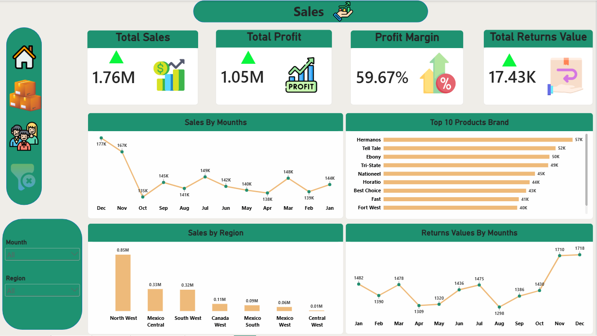
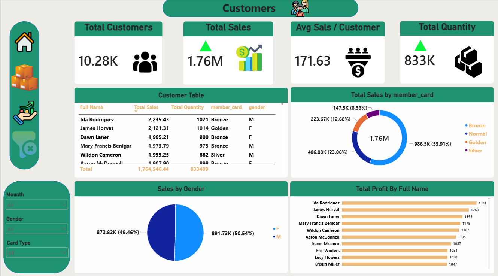
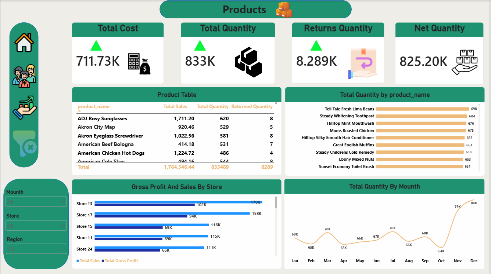
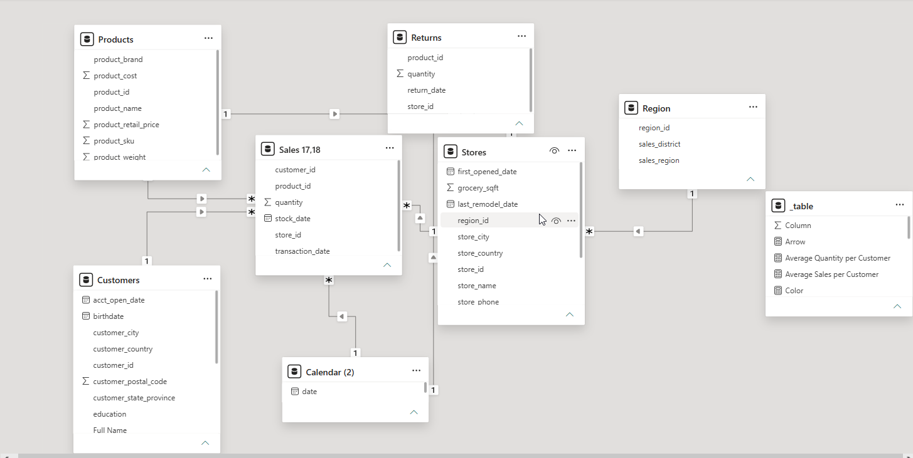

# 🛒 Hyper Market Sales Analysis

## 📊 Project Overview

An interactive sales analysis dashboard built using Microsoft Power BI to analyze the performance of a hypermarket.

The project focuses on transforming raw sales data into meaningful business insights through data cleaning, data modeling, DAX measures, and interactive dashboards.

## 🛠️ Tools & Skills

- Microsoft Power BI
- Power Query
- Data Cleaning
- Data Modeling
- DAX
- Data Visualization
- Business Analysis

## 📈 Dashboard Pages

### 🏠 Home
Overview of the key business performance indicators.

### 💰 Sales
Analysis of sales, profit, profit margin, returns, monthly trends, products, and regions.

### 👥 Customers
Analysis of customer sales, quantity, gender, membership cards, and top customers.

### 📦 Products
Analysis of product costs, quantities, returns, net quantity, and store performance.

### 🔗 Data Model
Relational data model connecting sales, products, customers, stores, returns, regions, and calendar tables.

## 📸 Dashboard Preview

### Home

### Sales

### Customers

### Products

### Data Model

## 📌 Key Insights

- Total Sales: 1.76M
- Total Profit: 1.05M
- Profit Margin: 59.67%
- Total Returns Value: 17.43K
- Total Customers: 10.28K
- Total Quantity: 833K

## 🎯 Project Objectives

- Analyze overall sales and profitability.
- Identify top-performing products and stores.
- Analyze customer purchasing behavior.
- Track sales and returns over time.
- Compare sales performance across regions.
- Build an interactive dashboard for business decision-making.

## 📁 Project Files

- `Hyper Market Sales Analysis.pbix` — Power BI project file.
- Dashboard screenshots — Visual previews of the analysis.
